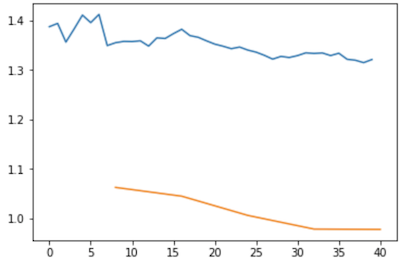

# fastai

Notes related to the study of fastai[^1]

[^1]: [fastai](https://fast.ai/)

## Vocabulary

Learning rate
: A thing we multiply our gradient by to decide how much to update the weights by.

Epoch
: One complete run through all of our data points (e.g. all of our images). So for non-stochastic gradient descent we just did, every single loop, we did the entire dataset. But if you've got a dataset with a thousand images and our mini-batch size is 100, then it would take you 10 iterations to see every image once. So that would be one epoch. Epochs are important because if you do lots of epochs, then you are looking at your images lots of times, so every time you see an image, there's a bigger chance of overfitting. So we generally don't want to do too many epochs.

Mini-batch
: A random bunch of points that you use to update your weights.

SGD
: Stochastic gradient descent using mini-batches.

Model / Architecture
: They kind of mean the same thing. In this case, our architecture is $\vec{y} = X\vec{a}$. The architecture is the mathematical function that you're fitting the parameters to. And we're going to learn later today or next week what the mathematical function of things like ResNet34 actually is. But it's basically pretty much what you've just seen. It's a bunch of matrix products.

Parameters / Coefficients / Weights
: Numbers that you are updating.

Loss function
: The thing that's telling you how far away or how close you are to the correct answer. For classification problems, we use cross entropy loss, also known as negative log likelihood loss. This penalizes incorrect confident predictions, and correct unconfident predictions.

## Notebook Methods

### Data Augmentation

Create randomization into the dataset. Cropping,
resizing, and padding.

### Normalize Images

Try to get each one of the channles to have mean zero
and standard deviation of one. 

### Notebook Setup

```python
# reload underlying library code automatically
%reload_ext autoreload
%autoreload 2

# make plots in this jupyter notebook
%matplotlib inline
```

### Imports

```python
from fastai import *
from fastai.vision import *
```

### Paths
.0.0.1:8000/
.0.0.1:8000/ith paths and creating them.
.0.0.1:8000/
.0.0.1:8000/
.0.0.1:8000/
.0.0.1:8000/
.0.0.1:8000/
.0.0.1:8000/
```

### Getting Help

```python
help(untar_data)

# shows the full documentation
doc(interp.plot_top_losses)
```

### data.show_batch

```python
data.show_batch(rows=3, figsize=(7,6))
```

### Useful methods

#### untar_data

```python
    path = untar_data(URLs.PETS); path
```

### Looking at Data

```python
print(data.classes)
len(data.classes), data.c

# ['american_bulldog', 'german_shorthaired', 'japanese_chin', 'great_pyrenees', 'Bombay', 'Bengal', 'keeshond', 'shiba_inu', 'Sphynx', 'boxer', 'english_cocker_spaniel', 'american_pit_bull_terrier', 'Birman', 'basset_hound', 'British_Shorthair', 'leonberger', 'Abyssinian', 'wheaten_terrier', 'scottish_terrier', 'Maine_Coon', 'saint_bernard', 'newfoundland', 'yorkshire_terrier', 'Persian', 'havanese', 'pug', 'miniature_pinscher', 'Russian_Blue', 'staffordshire_bull_terrier', 'beagle', 'Siamese', 'samoyed', 'chihuahua', 'Egyptian_Mau', 'Ragdoll', 'pomeranian', 'english_setter']

# (37, 37)
```

## Training

A model is training using a learner in fastai.

- **DataBunch** is a general class that stores Validation and Training (and optionally test data).
- **Learner** a general concept that can learn to fit a model.

```python
learn = create_cnn(data, models.resnet34,metrics=error_rate)
```

When downloading a ResNet34 it alreay includes pre-trained weights.

#### Transfer Learning

Take pretrained model and fit it to a different number of categories instead of 
1000 categories in imagenet.

#### Fitting Your Model

Use method called **fit_one_cycle** instead of **fit**. The one cycle learning produces dramatically more accurate and faster results than previous approaches:

- [learning rate, batch size, momentum, and weight decay by Leslie N. Smith](https://arxiv.org/pdf/1803.09820.pdf)

```python
# 4 determines how many times we show the dataset to the model
learn.fit_one_cycle(4)

Total time: 01:10

epoch  train loss  valid loss  error_rate
1      1.175709    0.318438    0.099800    (00:18)
2      0.492309    0.229078    0.075183    (00:17)
3      0.336315    0.211106    0.067199    (00:17)
4      0.233666    0.191813    0.057219    (00:17)
```

Saving the model

```python
learn.save('stage-1')
```

#### Results

The learn object knows two things:

1. What is your data
1. what is your model. This includes the architecture as well as the trained model.

To look at top locsses you can do:

```python
interp = ClassificationInterpretation.from_learner(learn)
interp.plot_top_losses(9, figsize=(15,11))

# print the items that you are most confused about
interp.most_confused(min_val=2)
```

#### Fitting Your Model

Only a few layers were added to the end of the resnet50 model. Most of the model was left as it really was. That is why it was really fast.

There is a two stage process. By default:

1. call **fit** or **fit_one_cycle** on the ConvLearner to fine tune the extra layers added at the very end.
1. call **unfreeze** to tell the training process to fit the whole model.
1. call **fit_one_cycle** on the model


```python

learn = create_cnn(data, models.resnet34,metrics=error_rate)

learn.fit_one_cycle(4)

Total time: 01:10

epoch  train loss  valid loss  error_rate
1      1.175709    0.318438    0.099800    (00:18)
2      0.492309    0.229078    0.075183    (00:17)
3      0.336315    0.211106    0.067199    (00:17)
4      0.233666    0.191813    0.057219    (00:17)

learn.unfreeze()
learn.fit_one_cycle(1)

Total time: 00:20
epoch  train_loss  valid_loss  error_rate
1      1.045145    0.505527    0.159681    (00:20)
```

!!! Note
    Error rate became worst in the second pass.

Fine-tuning a mdoel made things worst because by default it trains all alyers at the same speed. The early stages and latter stages will be updated at the same rate.

Can restart by relaoding the weights of the model. Use learning rate finder to find the appropriate learning rate:

```python
learn.lr_find()
learn.recorder.plot()
```

Based on the reslts of learn.fit_one_cycle you can determine the range of learning rates you want to use in the neural network:

```python
learn.unfreeze()
learn.fit_one_cycle(2, max_lr=slice(1e-6, 1e-4))

Total time: 00:41
epoch  train_loss  valid_loss  error_rate
1      0.226494    0.173675    0.057219    (00:20)
2      0.197376    0.170252    0.053227    (00:20)
```

!!! Note
    The slice keyword takes a start and stop value that says train the very first layers at a learning rate of 1e-6 and the very last layers at a rate of 1e-4. All other layers will be distributed equally between those two values.

##### Picking Learning Rates after Unfreezing

After you unfreeze pass a slice with the following values:

- make second part of the slice 10 times smaller than the first stage. The default is 1e-3 so we can make it 1e-4
- The first part of the slice should be a value from learning rate finder which is well before theings started getting worse.

### Things that can go wrong

Two main classes of problems:

1. Learning rate is too high or low
1. number of epochs is too high or low

#### Learning rate too high

The validation loss gets extremely high. Typically it should be underneath 1. 

```python
learn = create_cnn(data, models.resnet34, metrics=error_rate)

learn.fit_one_cycle(1, max_lr=0.5)

Total time: 00:13
epoch  train_loss  valid_loss  error_rate
1      12.220007   1144188288.000000  0.765957    (00:13)
```

!!! Note
    If validation loss high you need to make learning rate smaller. Need to create the neural net again anf fit it from scratch with a lower learning 
    rate. No way to undo this without recreating the model.

#### Learning Rate too Low

When Learning Rate is too low the error rate gets better but very very slowly. This takes a really long time and could cause overfitting because the learner gets too many looks at each image.

Remedy is to increase the learning rate by a factor of 10 or 100.

```python
learn.fit_one_cycle(5, max_lr=1e-5)

Total time: 01:07
epoch  train_loss  valid_loss  error_rate
1      1.349151    1.062807    0.609929    (00:13)
2      1.373262    1.045115    0.546099    (00:13)
3      1.346169    1.006288    0.468085    (00:13)
4      1.334486    0.978713    0.453901    (00:13)
5      1.320978    0.978108    0.446809    (00:13)
```

You can use **learn.recorder** to view the losses for the training and validation.



#### Too few epochs

The training loss is much higher than validation loss. Try running more epochs. You can also increase the learning rate if the error rate is decreasing very slowly.

```python
learn = create_cnn(data, models.resnet34, metrics=error_rate, pretrained=False)

learn.fit_one_cycle(1)

Total time: 00:14
epoch  train_loss  valid_loss  error_rate
1      0.602823    0.119616    0.049645    (00:14)
```

#### Too Many Epochs

Too many epochs can create "overfitting". If train too long the network will recognize the particular pictures you have but will not generalize well. Very hard to overfit a neural network. 

The only thing that tells you that you're overfitting is that the error rate improves for a while and then starts getting worst again. 

!!! Note
    Overfitting does not occur when training loss is lower than your validation loss. This is **absolutely note true**.

Any model that is trained correctly will always have lower training loss than validation loss. This is not a sign that you ahve done something wrong.

!!! Note
    The sign that you are overfitting is that your errors starts getting worse because that is what you care about.

### Questions

#### Why do we use 3e-4 as a default learning rate?

Imperical evidence shows that 3e-3 is a good default learning rate. After you unfreeze you generally pick $\frac{1}{10}$  of the first learning rate for the final stages. Typically  use lr_finder to find the learning rate to be used for the initial stages.

Basic approach for training looks like this:

1. **learn.fit_one_cycle**

    - some number of epochs, typical number is 4
    - some learning rate which defaults to 3e-3

1. Once the cycle is complete we **unfreeze**
1. **learn.fit_one_cycle(4, slice(xxx, 3e-4))**

```python
learn.fit_one_cycle(4, 3e-3)
learn.unfreeze()
learn.fit_one_cycle(4, slice(xxx, 3e-4))
```

#### What do you do if you have unbalanced classes?

Nothing should be done. Generally it works pretty well without much effort. There is a paper that said if you want to get slightly better performance is to make a few additional copies of the uncommon class. this amounts to oversampling.

#### What to do if after one cycle of unfreezing if your training data is still higher than your validation loss?

Once you unfreeze and retrain with one cycle again, if your training loss is still higher than your validation loss (likely underfitting), do you retrain it unfrozen again (which will technically be more than one cycle) or you redo everything with longer epoch per the cycle?

Either is fine. If you do another cycle, then it'll maybe generalize a little bit better. If you start again, do twice as long, it's kind of annoying, depends how patient you are. It won't make much difference. For me personally, I normally just train a few more cycles. But it doesn't make much difference most of the time.

### Overfitting and Underfitting


Using a function that does not have too many parameters is one way of reducing the likelihood of overfitting.  

#### Regularization and Validation Set

Using Regularization is the preferred technique for making your model generalize well. Crtical to know how well your model does on data that is has not seen before. Validation set serves as a check for how well the model is doing.
